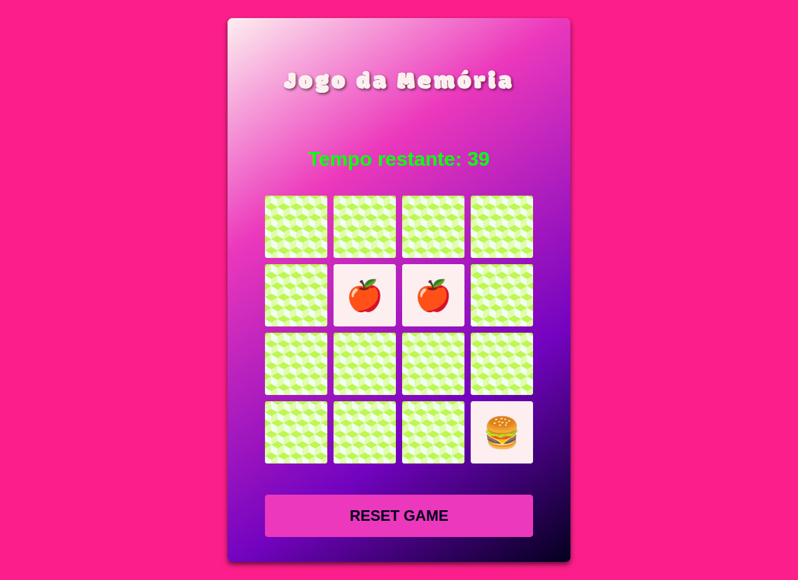

# Desafio Jogo da Memória com Emojis 🧠🎮✨

  

  Um divertido jogo da memória com emojis para testar sua concentração e agilidade!

## 🚀 Demonstração Online

[Link para a demonstração online do seu jogo (se houver)](https://[seu-link-aqui])

## ⚙️ Funcionalidades Principais

- **Interface Intuitiva:** Design limpo e fácil de usar.
- **Pares de Emojis:** Encontre todos os pares de emojis correspondentes.
- **Contador de Tempo:** Desafio de completar o jogo em 60 segundos.
- **Game Over:** Mensagem e reinício do jogo ao esgotar o tempo.
- **Música de Fundo:** Mergulhe na atmosfera do jogo com uma trilha sonora envolvente (com opção de autoplay no clique).
- **Efeitos Sonoros:** Feedback de áudio para vitória e derrota.
- **Animação de Vitória:** Celebre a conquista com uma chuva de confetes!
- **Recarregamento ao Final:** O jogo se reinicia automaticamente após a vitória ou derrota.
- **Botão "Start Game":** Controle total do início do jogo.

## 🛠️ Tecnologias Utilizadas

- **HTML:** Estrutura da página web.
- **CSS:** Estilização e design visual, incluindo um padrão de fundo personalizado para as cartas e animação de "virar".
- **JavaScript:** Lógica do jogo, controle do timer, manipulação do DOM, efeitos sonoros e animação de confetes (com a biblioteca `canvas-confetti`).
- **Biblioteca:** [`canvas-confetti`](https://www.npmjs.com/package/canvas-confetti) para a animação de confetes.
- **Arquivos de Áudio:**
  - `./sounds/fundo1.mp3`: Música de fundo do jogo (criada na SUNO).
  - `./sounds/Victory.mp3`: Música de vitória (Final Fantasy VII).
  - `./sounds/Failure.mp3`: Música de Game Over (Revenge of Shinobi).

## 📂 Estrutura de Arquivos

📁 css

├── 📄 reset.css

├── 📄 style.css

📁 imgs

├── 📄 screenshot_jogo_memoria.css

📁 js

├── 📄 engine.js

📁 sounds

├── 🔊 Failure.mp3

├── 🔊 fundo1.mp3

├── 🔊 Victory.mp3

📄 index.html

📄 readme.md

## 🕹️ Como Jogar

1.  Clone este repositório para o seu computador.
2.  Abra o arquivo `index.html` no seu navegador.
3.  Clique no botão **"Start Game"** para iniciar o jogo.
4.  Clique nas cartas para revelar os emojis.
5.  Encontre todos os pares de emojis correspondentes antes que o tempo de 60 segundos se esgote.
6.  Se você encontrar todos os pares a tempo, uma animação de confetes e um efeito sonoro de vitória serão exibidos.
7.  Se o tempo acabar, você ouvirá um efeito sonoro de Game Over.
8.  Após a vitória ou derrota, a página será recarregada para iniciar um novo jogo.

## 🤝 Contribuição

Sinta-se à vontade para contribuir com melhorias, correções de bugs ou novas funcionalidades! Basta criar um fork do repositório e enviar um pull request.

## 📄 Licença

Este projeto está sob a licença [MIT](https://opensource.org/licenses/MIT).

---

Feito com ❤️ por LeonardoSabino2025
Encontre-me no LinkedIn: https://www.linkedin.com/in/leonardo-sabino/
